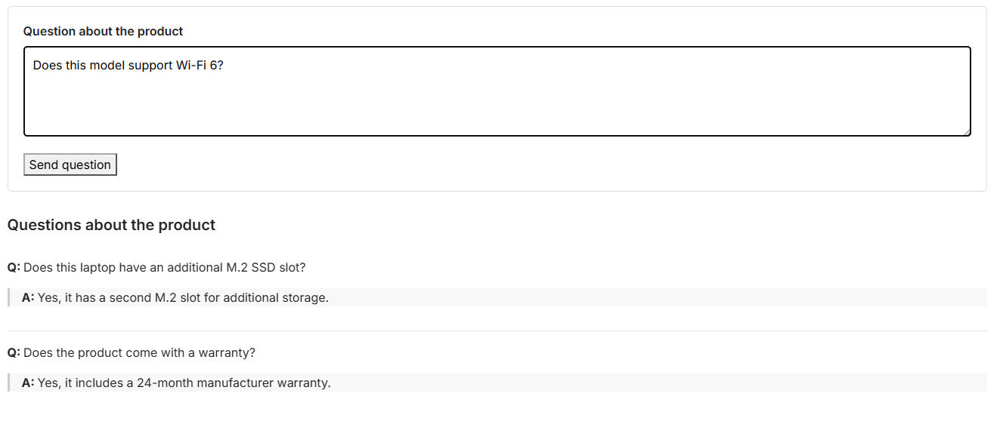
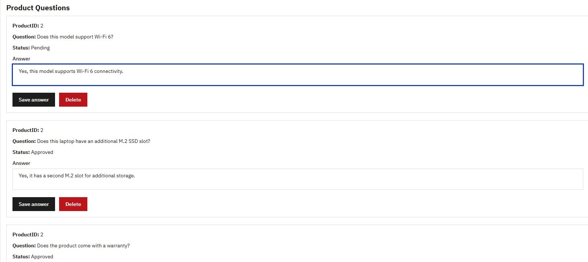

# PrestaShop Product Questions

A custom PrestaShop module that allows customers to ask questions about products and enables store administrators to moderate and answer or delete them from the Back Office.

## Features

- Product question form displayed on product pages
- Question moderation workflow
- Admin answers visible on the product page
- Delete/reject questions from Back Office
- CSRF protection for question submission
- Input validation
- Custom database table for storing questions and answers
- Smarty templates for frontend and admin views
- Basic frontend styling integrated with PrestaShop

## How it works

1. A customer submits a question from a product page.
2. The question is validated and stored in the database with pending status.
3. The administrator reviews the question in the module configuration panel.
4. The administrator can:
   - answer and approve the question,
   - delete the question.
5. Approved questions and answers are displayed on the corresponding product page.

## Tech stack

- PHP 8
- PrestaShop 9
- Smarty
- MariaDB / MySQL
- HTML
- CSS
- Docker

## Project structure

```text
modules/productquestions/
├── controllers/
│   └── front/
│       └── submit.php
├── sql/
│   └── install.php
├── views/
│   ├── css/
│   │   └── productquestions.css
│   └── templates/
│       ├── admin/
│       │   └── configure.tpl
│       └── hook/
│           └── product_questions.tpl
└── productquestions.php
```

## Security

The module includes several basic security measures:

- CSRF token validation
- Product ID validation
- Input length validation
- Integer casting of database identifiers
- SQL escaping using PrestaShop's 'pSQL()' utility
- HTML escaping in Smarty templates to reduce XSS risk

## Installation

There are two ways to use this repository:

### Option 1: Run the full Docker development enviroment

Use this option if you want to run the same local environment used during development.

1. Clone the repository:

```bash
git clone https://github.com/Dejmjen/prestashop-product-questions.git
cd prestashop-product-questions
```

2. Create your local environment file from provided example:

**Linux / macOS**
```bash
cp .env.example .env
```

**Windows PowerShell**
```
Copy-Item .env.example .env
```

3. Review the values in .env and adjust them if needed.

Do not commit your local .env file. The repository contains .env.example as a safe configuration template.

4. Start the containers:

```bash
docker compose up -d
```

5. Complete the PrestaShop installation if required.

6. Open PrestaShop Back Office and install the **Product Questions** module from:

```text
Modules > Module Manager
```

Default Back Office credentials, if not changed in `.env`:
```text
E-mail: admin@example.com
Password: Admin123!
```

7. Questions can be moderated from the module configuration page in Back Office.

### Option 2: Install only the module in an existing PrestaShop store

Use this option if you already have a working PrestaShop installation.

1. Download or clone this repository.

2. Copy:

```text
modules/productquestions
```

from this repository into the `modules/` directory of your PrestaShop installation.

The final structure should look like:

```text
prestashop/
└── modules/
    └── productquestions/
        ├── controllers/
        ├── sql/
        ├── views/
        └── productquestions.php
```

3. Open the PrestaShop Back Office.

4. Go to:

```text
Modules > Module Manager
```

5. Find **Product Questions** and install it.

## Screenshots

### Product page



### Back Office



## Development environment

The project was developed using a Docker-based PrestaShop environment with MariaDB.

Example setup:

```text
PrestaShop 9
MariaDB 11
Docker / Docker Compose
```

## Possible future improvements

- Pagination in Back Office
- Filtering questions by status
- Email notification when a new question is submitted
- Separate moderation and answer statuses
- Improved admin UI
- Automated tests

## Author

Dejmjen

## License

This project was created as a portfolio and learning project.